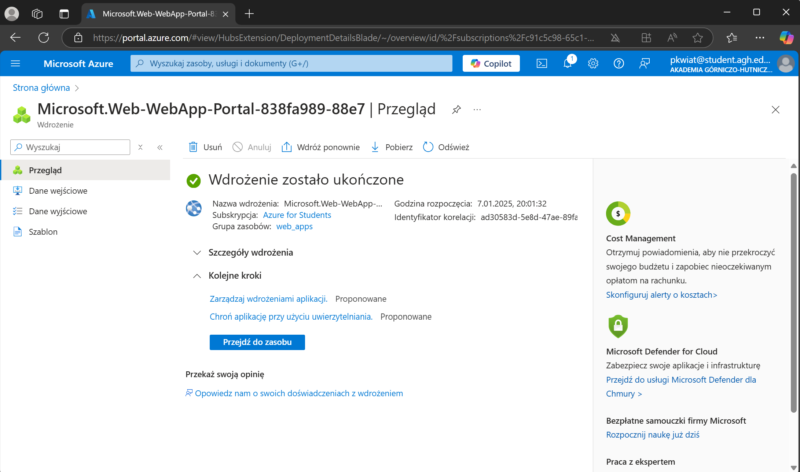

# PeterTheFlower - GitHub Profile

Cześć! 👋 Jestem **PeterTheFlower**, student na **AGH** (Akademia Górniczo-Hutnicza) w Krakowie.

- 🎓 Aktualnie studiuję na kierunku Cyberbezpieczeństwo.
- 💻 Oprócz cyberbezpieczeństwa interesuję się sportem, medycyną pola walki i strzelaniem.
- 📚 Uwielbiam rozwiązywać problemy i szukać rozwiązań.
- 🌱 Uczę się nowych technologii i poznaję świat **CYBER**.

Tutaj link do mojej strony: https://petertheflower.github.io/

Tutaj link do strony azure: https://wdi-web-app-a3gudyc0a5csacbc.polandcentral-01.azurewebsites.net/

# Tworzenie strony w Azure

W tej sekcji opisuję, jak stworzyć stronę internetową w ramach platformy **Microsoft Azure**.

### Krok 1: Utworzenie subskrypcji i konta w Azure
1. Zarejestruj się na platformie [Azure](https://azure.microsoft.com/pl-pl/free/).
2. Zaloguj się do **Azure Portal**.

### Krok 2: Utworzenie aplikacji webowej
1. Wyszukaj usługę **App Service**.
2. Utwórz nową aplikację, wybierając odpowiednią subskrypcję, grupę zasobów i plan hostingu.
3. Po utworzeniu aplikacji, otrzymasz adres URL w postaci `https://nazwa-aplikacji.azurewebsites.net`.

### Krok 3: Wgrywanie plików strony
1. Przygotuj pliki strony (HTML, CSS, PHP).
2. Użyj **FTP** lub **Git** do przesłania plików na serwer.
3. Po zakończeniu procesu, strona będzie dostępna pod przypisanym adresem URL.

Dzięki za odwiedzenie mojego profilu! 😊 Jeśli masz pytania, czuj się swobodnie, żeby się ze mną skontaktować!

---

## Kontakt
- 📧 Email: [fakemail](fakemail@fakemail.com)
